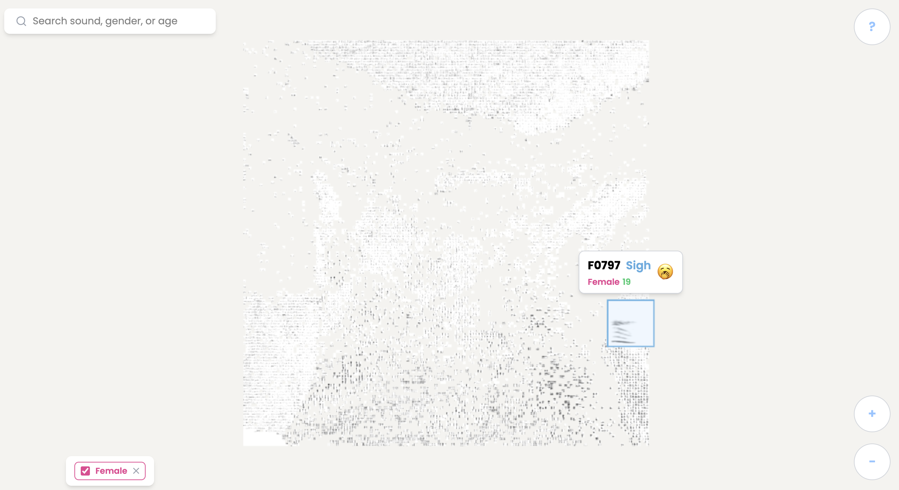

# CaCOUGHony
An interactive visualization to organize thousands of human health sounds via t-SNE



## About

Human health sounds — like coughing, sneezing, wheezing, and laughing — carry valuable diagnostic information. These sounds vary widely across individuals but can offer deep insights into respiratory and overall health.

An understanding of these sounds, based solely on their auditory properties, can provide an effective tool for healthcare. For instance, a model can compare an individual's throat clearing sound to typical patterns of throat clearing for healthy populations to potentially diagnose an illness.

A first step towards understanding health sounds involves clustering them. This experiment uses machine learning to organize thousands of human health sounds, among six classes: cough, sneeze, sniff, sigh, throatclearing, laughter. We use VocalSound as our open-source health dataset. This visualization is built entirely through *unsupervised* learning. The model was not given any labels (like sound type or speaker information). Rather, using a technique called t-SNE, the computer created this map purely on acoustic features, and we can observe that similar sounds are placed closer together.

The project can be viewed from the following link: COMING SOON

## Usage

Here we describe the basic pipeline for transforming raw audio files into an effective visualization. If you want to create a similar visualization for a different audio dataset, follow these instructions with a different audio folder.

CaCOUGHony/
├── backend/
│   ├── Audio_Preprocessing.ipynb
│   ├── HeAR_embeddings.ipynb
│   └── t-SNE_and_grid_clustering.ipynb
├── ca-cough-ony/         # React frontend
│   ├── public/
│   ├── src/
│   └── package.json
├── requirements.txt
└── README.md

### Backend Setup (Python)

To build the backend Python, first create a virtual environment and install the required dependencies.

Some commands to create a virtual environment
```python3 -m venv .venv```
```source .venv/bin/activate```
```pip install -r requirements.txt```

After installing dependencies, run the following notebooks in order, modifying the folder name for audio data:

First, save your dataset locally. In our example, we have a source directory `vs_release_16k/audio_16k`.

1. Audio_Preprocessing.ipynb

This notebook involves pre-processing the human health audio data to create audio suitable for the HeAR model to form embeddings. This involves trimming silence, removing short/quiet clips, and capping the length of clips. Additionally, we create spectrograms to be used by the frontend visualization.

2. HeAR_embeddings.ipynb

This notebook uses the Google HeAR model to create and utilize embeddings. The model is loaded directly from Hugging Face, and we use the preprocessed data to create and test our embeddings.

3. t-SNE_and_grid_clustering.ipynb

This notebook runs the t-SNE algorithm to cluster the HeAR embeddings, searching over various perplexities. It then runs the LAP solver to convert the t-SNE output into a 2D grid, and saves the output as a JSON for our frontend visualization.

### Frontend Setup (React)

To build the client-side React, make sure you are in the `ca-cough-ony` folder. Then install node and run `npm install`.

Place the generated JSON file (from the backend step) into the main `ca-cough-ony` folder. Copy the spectrogram and processed audio folders into the`public/`directory. Then run:

`npm run dev`

## Results


## Credit

Built by Hisham Bhatti at the Ubiquitous Computing Lab at the University of Washington. Thanks to Zhihan Zhang for his support.

This project was based on Bird Sounds at Google Creative Lab, but designed with modern tooling, and for others to test with their own datasets. In particular, below are some notebooks that I took inspiration from:

* Generating Spectrograms: https://github.com/kylemcdonald/AudioNotebooks/blob/master/Generating%20Spectrograms.ipynb
* train_data_efficient_classifier: https://github.com/Google-Health/hear/blob/master/notebooks/train_data_efficient_classifier.ipynb
* Fingerprints to t-SNE: https://github.com/kylemcdonald/AudioNotebooks/blob/master/Fingerprints%20to%20t-SNE.ipynb
* ClouToGrid: https://github.com/kylemcdonald/CloudToGrid

The core embedding model is Google’s HeAR model, available on Hugging Face https://huggingface.co/google/hear

The dataset used is VocalSound, an open-source collection of human health sounds.

The human health audio dataset that I used was VocalSound: https://github.com/YuanGongND/vocalsound


## Built With

Backend: Python, Jupyter Notebook,
Frontend: HTML/CSS/Javascript, React, Vite, Tailwind CSS,
